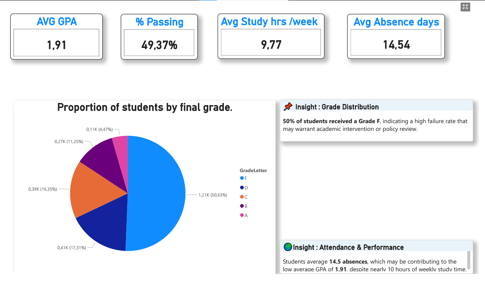
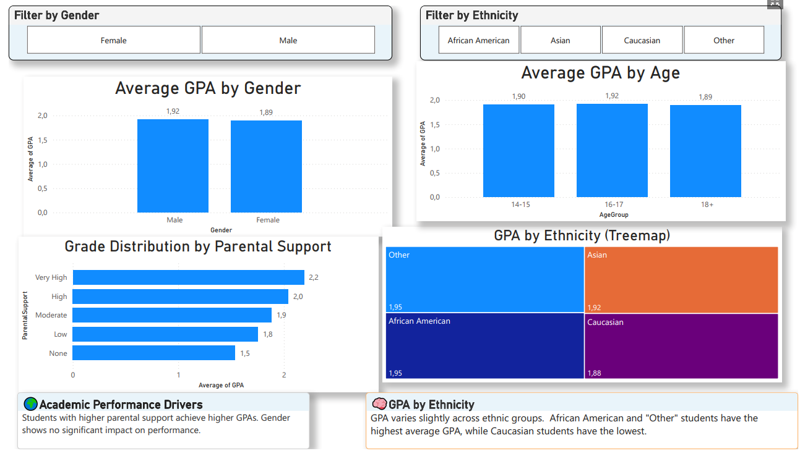
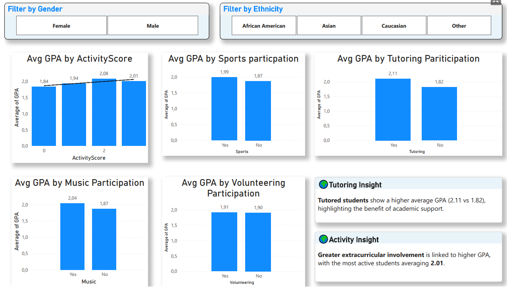
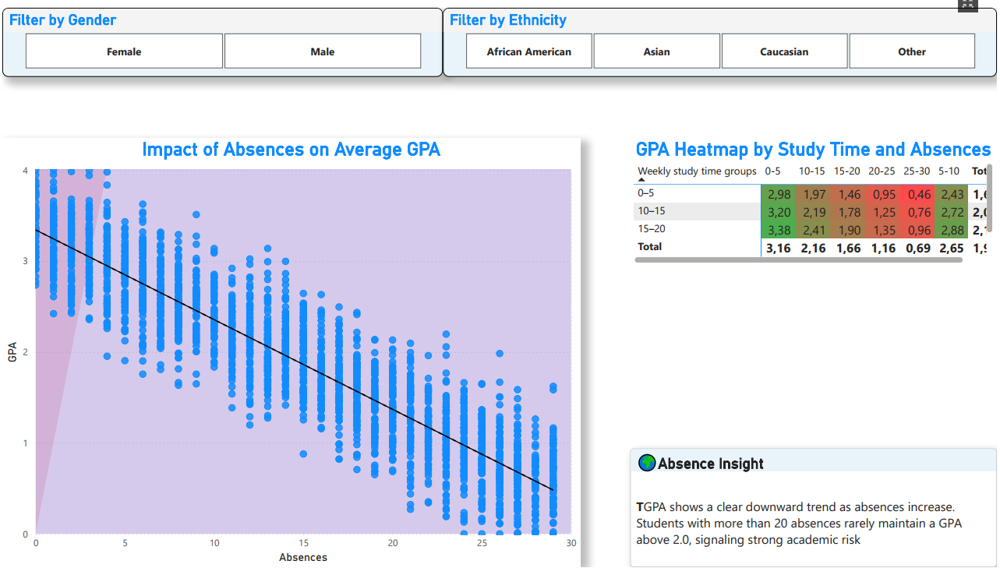
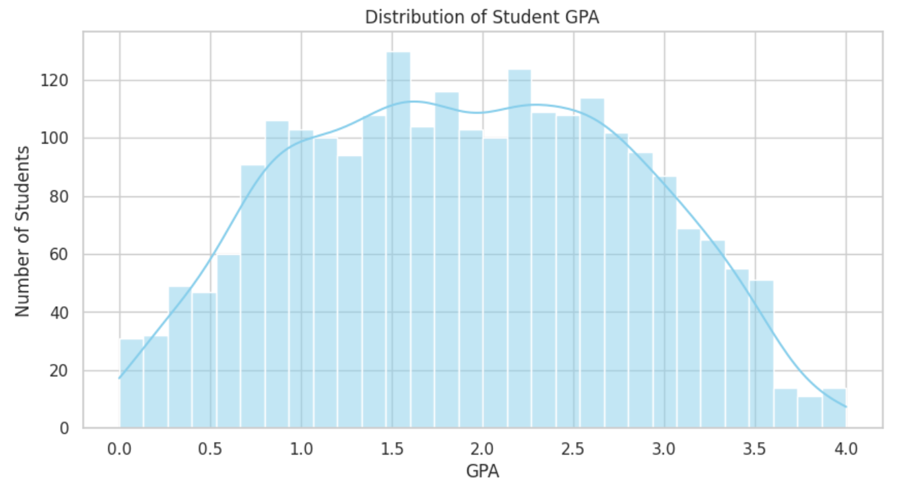
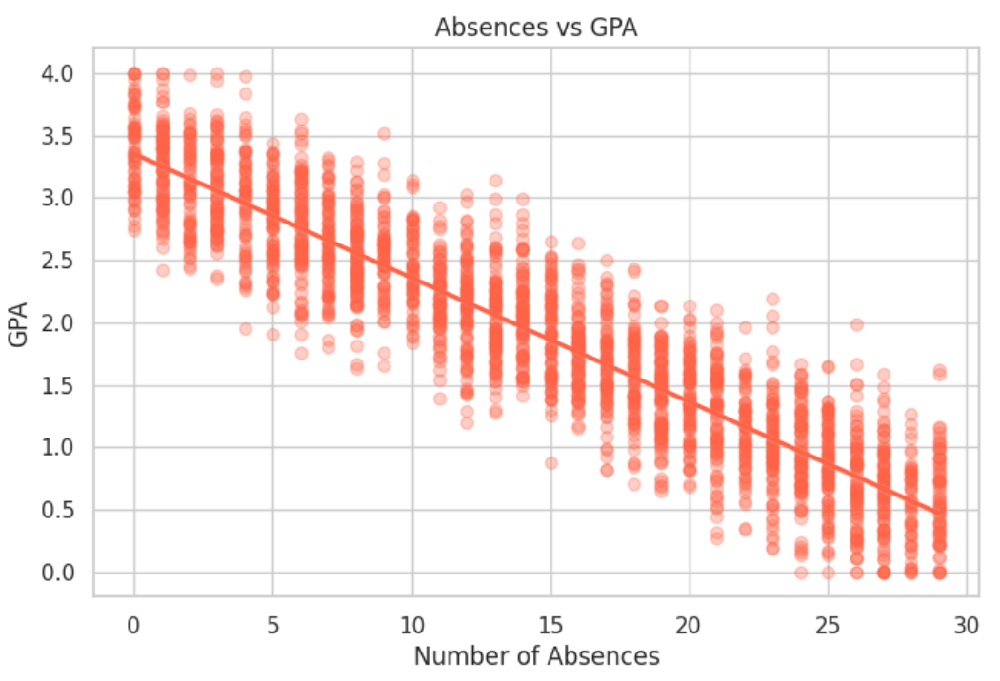
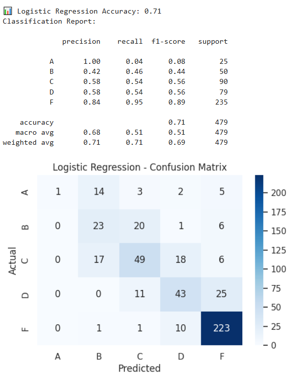

# 🎓 Student Performance Analytics Dashboard

This project explores student academic performance using SQL, Python, and Power BI. It cleans and analyzes raw student data to uncover key behavioral and demographic drivers of success, supported by predictive modeling and interactive dashboards.

---

## 🎯 Project Objectives

- Clean and transform student data using SQL
- Perform Exploratory Data Analysis (EDA) in Python
- Identify patterns between GPA, support, demographics, and behavior
- Build predictive models to detect at-risk students
- Develop a Power BI dashboard for stakeholder insights

---

## 📸 Dashboard Preview

### 🧮 Overview Page


### 👥 Demographic Factors


### 🎭 Behavioral Drivers


### ⚠️ Risk Factors



## 📊 Dashboard Preview

The Power BI dashboard includes:

- KPI Cards (Avg GPA, % Failing, Study Time, Absences)
- Grade Distribution Pie Chart
- GPA by Gender, Parental Support, and Ethnicity
- GPA by Activity Involvement and Tutoring
- Scatterplot: Absences vs GPA with Trend Line
- Matrix Heatmap: Study Time × Absences vs GPA

📂 Location: `powerbi/Student_Performance_Dashboard.pbix`

---

## 🔍 Key Insights

- **50% of students received a Grade F**, with average GPA at **1.91**
- **Tutoring and extracurricular activities** correlate with higher GPA
- **High absences** are strongly linked to lower GPA
- Predictive models (Logistic Regression) identify at-risk students with **71% accuracy**

---

---

## 📈 EDA & Modeling Visuals

### 📊 GPA Distribution

> Most students cluster between GPA 1.5–2.5, with few above 3.0.

### 📉 Absences vs GPA

> GPA tends to decrease as absences increase — a clear negative correlation.
>
### 🧑‍🏫 GPA by Tutoring Status

> Students who received tutoring had a higher GPA on average, suggesting a positive academic impact.


### 🧠 Confusion Matrix

> The logistic regression model correctly predicts most failing students, with some false positives.


## 🧠 Modeling Summary

Model: Logistic Regression, Decision Tree  
Target: GradeLetter (A–F)  
Features: Absences, StudyTime, ParentalSupport, ActivityScore, Tutoring  
Evaluation: Confusion matrix, accuracy, precision/recall, F1-score

---

## 📁 Project Structure

```
education-analytics-portfolio/
│
├── data/                   # Edu_cleaned_data.xlsx
├── sql/                    # SQL cleaning script (.sql)
├── notebooks/              # Python EDA + modeling (.ipynb)
├── powerbi/                # Power BI .pbix file
│   └── themes/             # JSON theme for KPI visuals
├── visuals/                # Screenshots of dashboard pages and python Visuals (optional)
├── reports/                # Final report PDF (exported from Power BI)
└── README.md               # Project overview
```

---

## 🧰 Tools & Technologies

- **SQL (BigQuery/SQLite)** – Data cleaning and transformation
- **Python (Pandas, Matplotlib, Scikit-learn)** – EDA + modeling
- **Power BI** – Visual storytelling and stakeholder dashboard
- **GitHub** – Version control and portfolio hosting

---

## 🚀 How to Use

1. Clone the repo or download specific folders
2. Open `data/Edu_cleaned_data.xlsx` to explore the dataset
3. Open `powerbi/Student_Performance_Dashboard.pbix` in Power BI Desktop
4. Run analysis or modeling in the Jupyter notebook (`notebooks/`)

---

## ✅ Next Steps

- Add more granular features (exam scores, teacher feedback)
- Deploy predictive model in an app or automated alert system
- Extend dashboard with slicers for live student filtering

---

**Made with 🔍 curiosity and 📊 data.**
