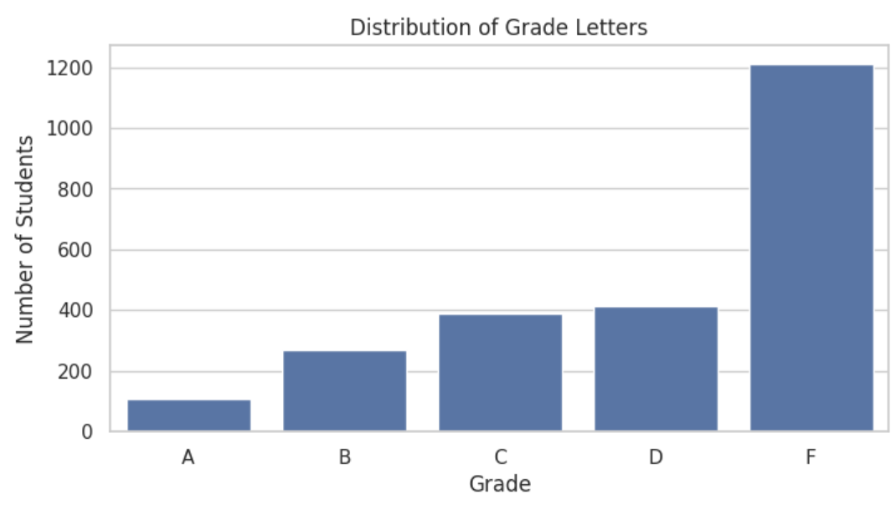
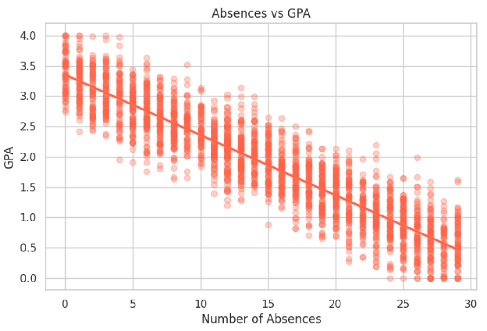
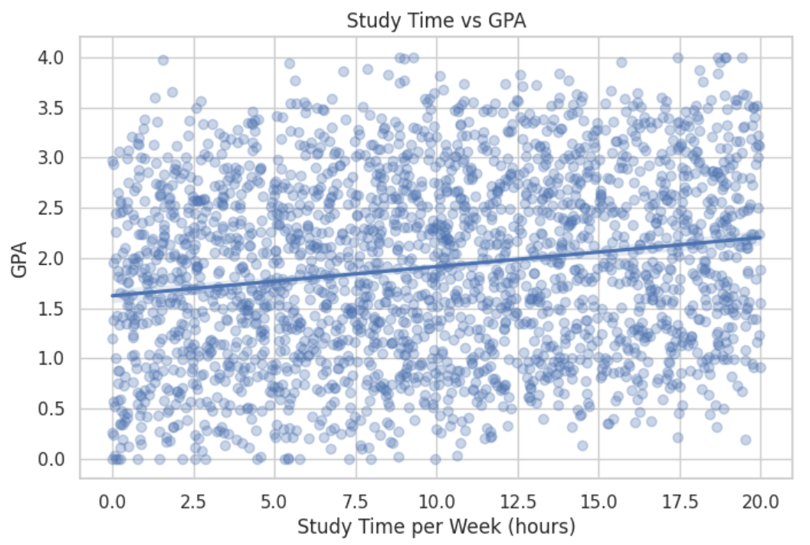
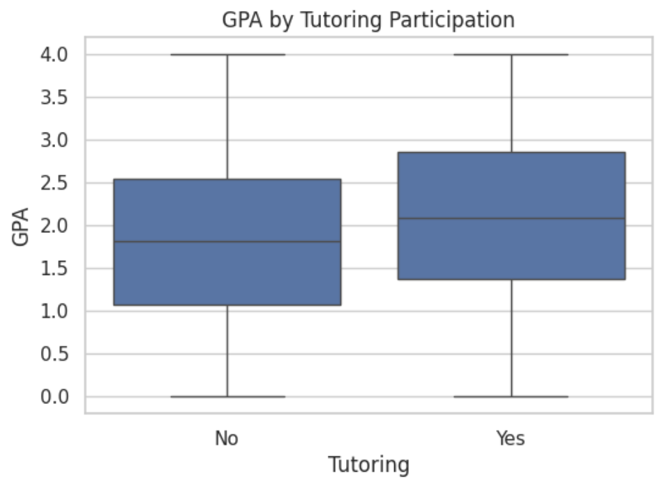
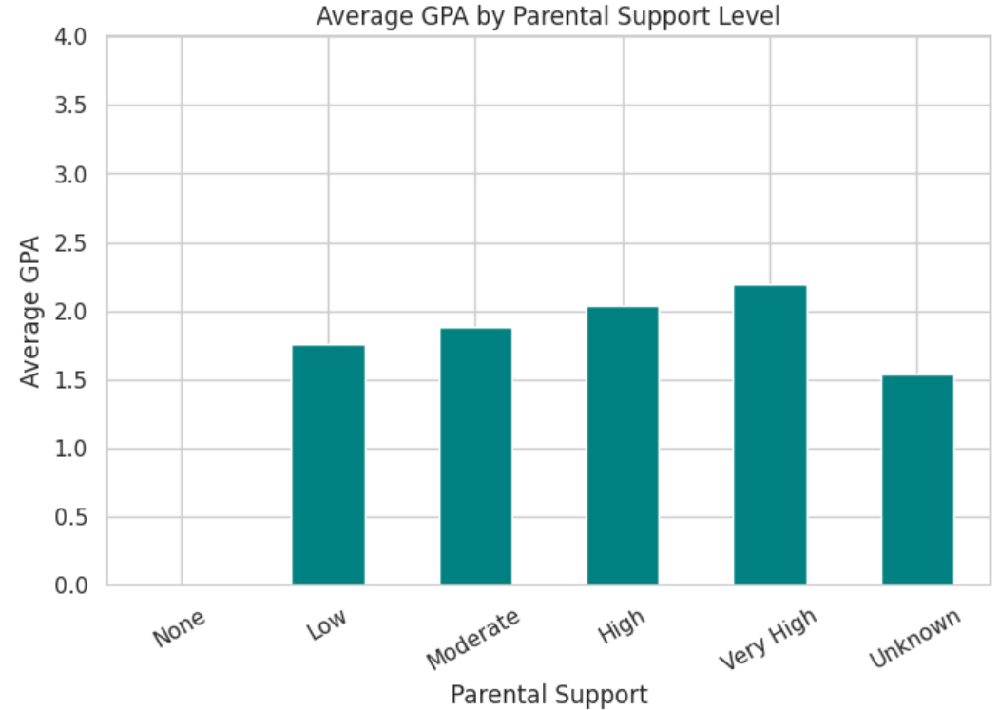
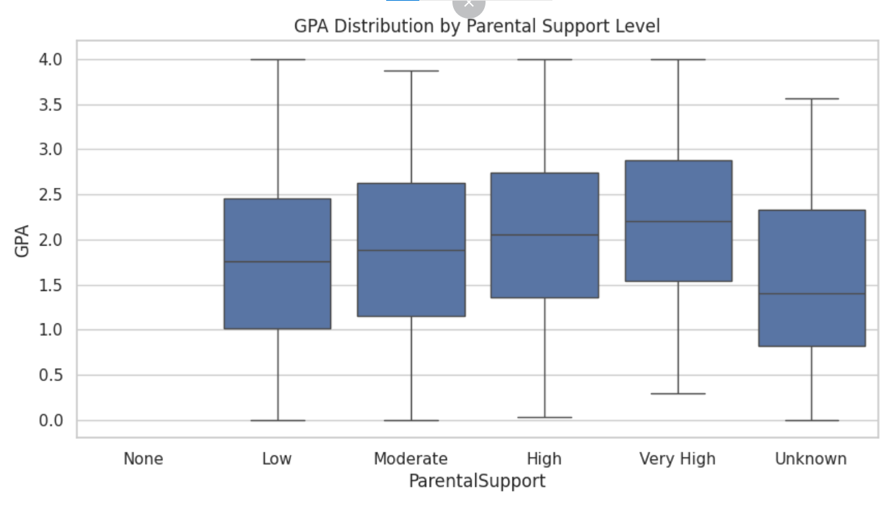
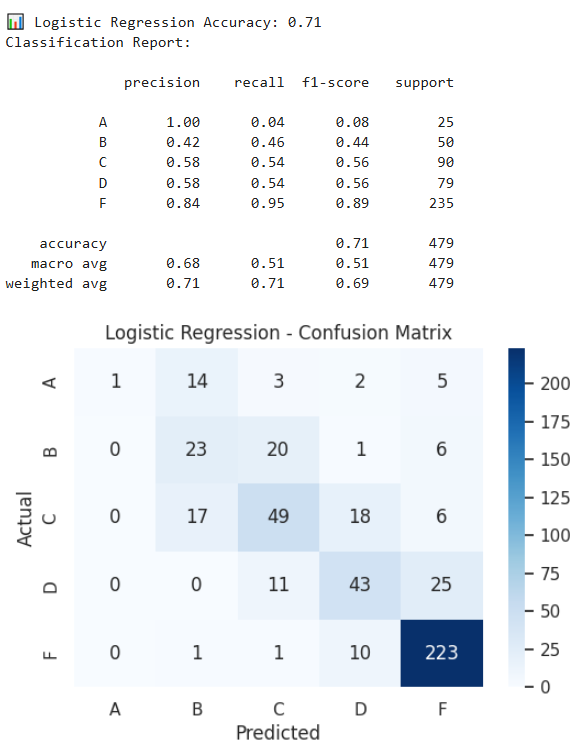
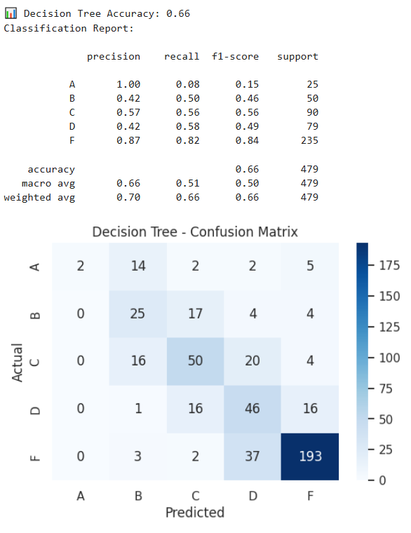

# 🎓 Student Performance Analytics Dashboard

This project explores student academic performance using SQL, Python, and Power BI. It cleans and analyzes raw student data to uncover key behavioral and demographic drivers of success, supported by predictive modeling and interactive dashboards.

---

## 🎯 Project Objectives

- Clean and transform student data using SQL
- Perform Exploratory Data Analysis (EDA) in Python
- Identify patterns between GPA, support, demographics, and behavior
- Build predictive models to detect at-risk students
- Develop a Power BI dashboard for stakeholder insights

---

## 📸 Dashboard Preview

### 🧮 Overview Page


### 👥 Demographic Factors


### 🎭 Behavioral Drivers


### ⚠️ Risk Factors


## 📊 Dashboard Preview

The Power BI dashboard includes:

- KPI Cards (Avg GPA, % Failing, Study Time, Absences)
- Grade Distribution Pie Chart
- GPA by Gender, Parental Support, and Ethnicity
- GPA by Activity Involvement and Tutoring
- Scatterplot: Absences vs GPA with Trend Line
- Matrix Heatmap: Study Time × Absences vs GPA

📂 Location: `powerbi/Student_Performance_Dashboard.pbix`

---

## 🔍 Key Insights

- **50% of students received a Grade F**, with average GPA at **1.91**
- **Tutoring and extracurricular activities** correlate with higher GPA
- **High absences** are strongly linked to lower GPA
- Predictive models (Logistic Regression) identify at-risk students with **71% accuracy**

---

---
---

## 📈 EDA & Modeling Visuals

### 📊 GPA Distribution

> Most students cluster between GPA 1.5–2.5, with fewer high performers above 3.0.

### 📉 Grade Letter Distribution

> Over half of students received a Grade F, indicating low overall performance.

### 📉 Absences vs GPA

> GPA shows a strong negative correlation with absences — more absences, lower GPA.

### ⏱️ Study Time vs GPA

> Slight positive trend — more study hours correlate with slightly higher GPA.

### 🧑‍🏫 GPA by Tutoring Status

> Students who received tutoring had a higher average GPA, supporting the value of academic support programs.

### 👪 GPA by Parental Support

> GPA tends to increase with the level of parental support.

### 📦 GPA by Support Level (Boxplot)

> Boxplot confirms the trend — students with “Very High” support tend to outperform others.

---

## 🤖 Model Performance

### 🧠 Confusion Matrix (Logistic Regression)

> Logistic regression predicted failing students well, though with limited sensitivity for top grades.

### 🌳 Confusion Matrix (Decision Tree)

> Decision tree was slightly less accurate overall, especially on A–C grade classes.


## 🧠 Modeling Summary

Model: Logistic Regression, Decision Tree  
Target: GradeLetter (A–F)  
Features: Absences, StudyTime, ParentalSupport, ActivityScore, Tutoring  
Evaluation: Confusion matrix, accuracy, precision/recall, F1-score

---

## 📁 Project Structure

```
education-analytics-portfolio/
│
├── data/                   # Edu_cleaned_data.xlsx
├── sql/                    # SQL cleaning script (.sql)
├── notebooks/              # Python EDA + modeling (.ipynb)
├── powerbi/                # Power BI .pbix file
│   └── themes/             # JSON theme for KPI visuals
├── visuals/                # Screenshots of dashboard pages and python Visuals (optional)
├── reports/                # Final report PDF (exported from Power BI)
└── README.md               # Project overview
```

---

## 🧰 Tools & Technologies

- **SQL (BigQuery/SQLite)** – Data cleaning and transformation
- **Python (Pandas, Matplotlib, Scikit-learn)** – EDA + modeling
- **Power BI** – Visual storytelling and stakeholder dashboard
- **GitHub** – Version control and portfolio hosting

---

